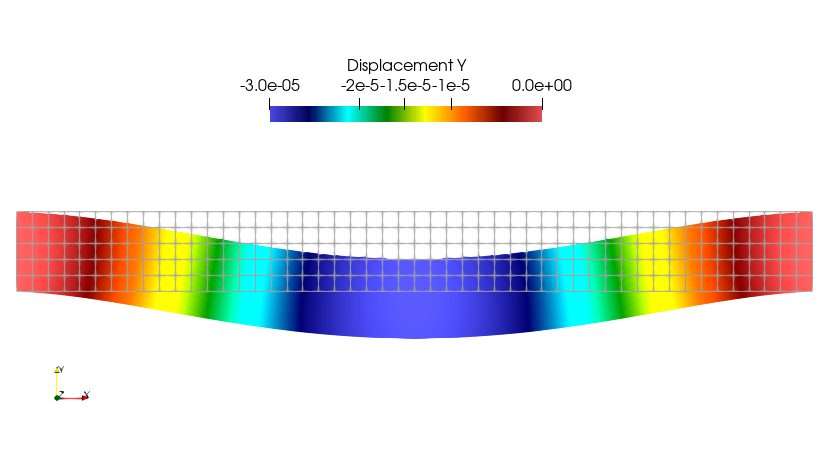
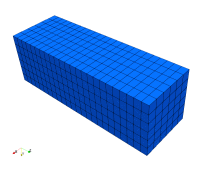
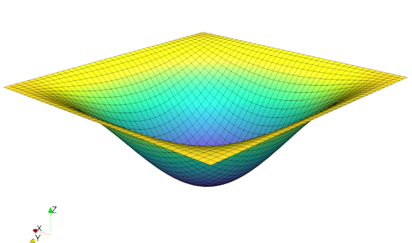
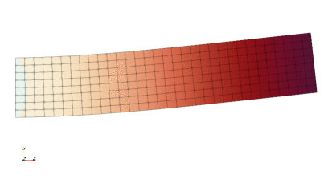
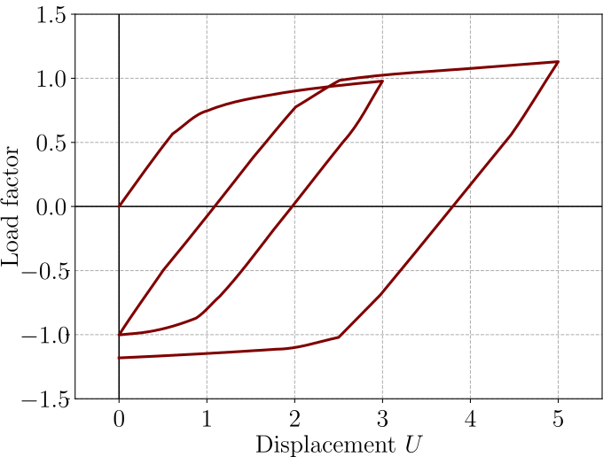
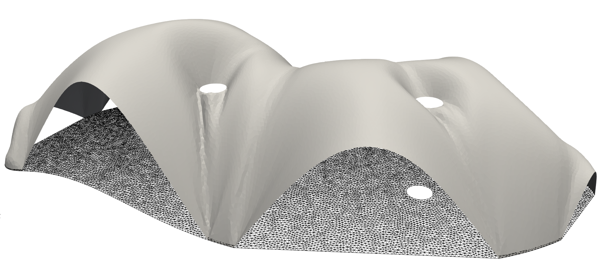

<h1 style="text-align: center;" class="ignore-toc"> Numerical Tours of Computational Mechanics with FEniCSx</h1>
<h3 style="text-align: center;" class="ignore-toc"> Jeremy Bleyer</h3>

$\,$

```{image} images/logo.png
:width: 800px
:align: center
```

$\,$

# Welcome


## What is it about ?

These numerical tours will introduce you to a wide variety of topics in computational continuum and structural mechanics using the finite element software `FEniCSx`, http://fenicsproject.org.

This book is organized in the following different parts:

### Introduction

This part contains a set of short demos to get introduced to `FEniCSx` via basic examples:

```{grid} 1

  ```{grid-item-card} [**Introductory demos**]{.h3 .pst-color-primary}
  :text-align: center
  :shadow: lg

    ```{grid} 3

      ```{grid-item-card} [**Linear elasticity**]{.pst-color-primary}
      :link: intro/linear_elasticity/linear_elasticity.html

      
      ```

      ```{grid-item-card} [**Nonlinear elasticity**]{.pst-color-primary}
      :link: intro/hyperelasticity/hyperelasticity.html
      
      
      ```

      ```{grid-item-card} [**Multi-field plate problem**]{.pst-color-primary}
      :link: intro/plates/plates.html
      
      
      ```
    ```

  ```

```{seealso}
For another general introduction to `FEniCSx`, we heavily recommend to follow the "official" [FEniCSx tutorial](https://jsdokken.com/dolfinx-tutorial/index.html) by Jørgen S. Dokken.
```

### Tours

This part is the main body of this book. These numerical tours are intended to complement the existing `FEniCSx` tutorials in the official documentation by focusing on specific applications within the field of computational solid and structural mechanics. The purpose of these tours is to offer users with a background in mechanics a starting point for utilizing `FEniCSx`, using examples familiar to them.

While many of the covered topics are standard and relatively easy to implement, others, such as structural elements (beams, plates, and shells) or nonlinear constitutive models, present more complexity.
Other topics will also be more advanced and exploratory and will reflect currently investigated research topics, illustrating the versatility of `FEniCSx` for handling advanced models. The difficulty of each tour will be indicated by the star symbols: {far}`star` = easy, {far}`star`{far}`star`{far}`star` = difficult.

```{grid} 1

  ```{grid-item-card} [**Numerical tours**]{.h3 .pst-color-primary}
  :text-align: center
  :shadow: lg

    ```{grid} 3

      ```{grid-item-card} [**Linear problems**]{.pst-color-primary}
      :link: tours/linear_problems/contents.html

      
      ```

      ```{grid-item-card} [**Dynamics problems**]{.pst-color-primary}
      :link: tours/dynamics/contents.html
      
      
      ```

      ```{grid-item-card} [**Nonlinear problems**]{.pst-color-primary}
      :link: tours/nonlinear_problems/contents.html
      
      
      ```

      ```{grid-item-card} [**Eigenvalue problems**]{.pst-color-primary}
      :link: tours/eigenvalue_problems/contents.html
      
      
      ```

      ```{grid-item-card} [**Plates**]{.pst-color-primary}
      :link: tours/plates/contents.html
      
      
      ```

      ```{grid-item-card} [**Shells**]{.pst-color-primary}
      :link: tours/shells/contents.html

      
      ```
    ```

  ```

```{seealso}
The previous set of numerical tours based on the legacy `FEniCS` version can be found here https://comet-fenics.readthedocs.io/.
```


### Tips & Tricks

This part provides code snippets for various small tasks frequently encountered in computational mechanics with `FEniCSx`.


## Citing

If you find these demos useful for your research work, please consider citing them using the following Zenodo DOI:

[](https://doi.org/10.5281/zenodo.10470942)

```
@software{bleyer2024comet,
  author       = {Bleyer, Jeremy},
  title        = {{Numerical tours of Computational Mechanics with 
                   FEniCSx}},
  month        = jan,
  year         = 2024,
  publisher    = {Zenodo},
  version      = {v0.1},
  doi          = {10.5281/zenodo.10470942},
  url          = {https://doi.org/10.5281/zenodo.10470942}
}
```

All this work is licensed under the [Creative Commons Attribution-ShareAlike 4.0 International License](http://creativecommons.org/licenses/by-sa/4.0/>) .


## About the author

[Jeremy Bleyer](https://sites.google.com/site/bleyerjeremy/) is a researcher in Solid and Structural Mechanics at [Laboratoire Navier](https://navier-lab.fr), a joint research  (UMR 8205) of [Ecole Nationale des Ponts et Chaussées](http://www.enpc.fr),
[Université Gustave Eiffel](https://www.univ-gustave-eiffel.fr/) and [CNRS](http://www.cnrs.fr).

[{fas}`at` jeremy.bleyer@enpc.fr](mailto:jeremy.bleyer@enpc.fr)

[{fab}`linkedin` jeremy-bleyer](http://www.linkedin.com/in/jérémy-bleyer-0aabb531)

<a href="https://orcid.org/0000-0001-8212-9921">

 0000-0001-8212-9921
</a>

$\,$

```{image} images/banner_tutelles.png
:class: bg-primary mb-1
:width: 600px
:align: center
```

### Other contributors

```{include} CONTRIBUTORS.md
```
